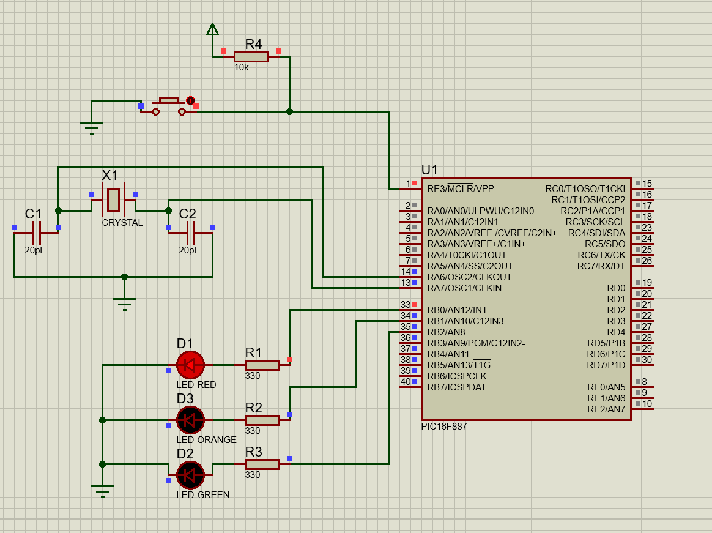
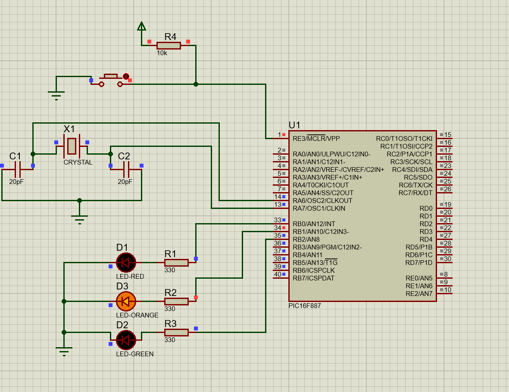
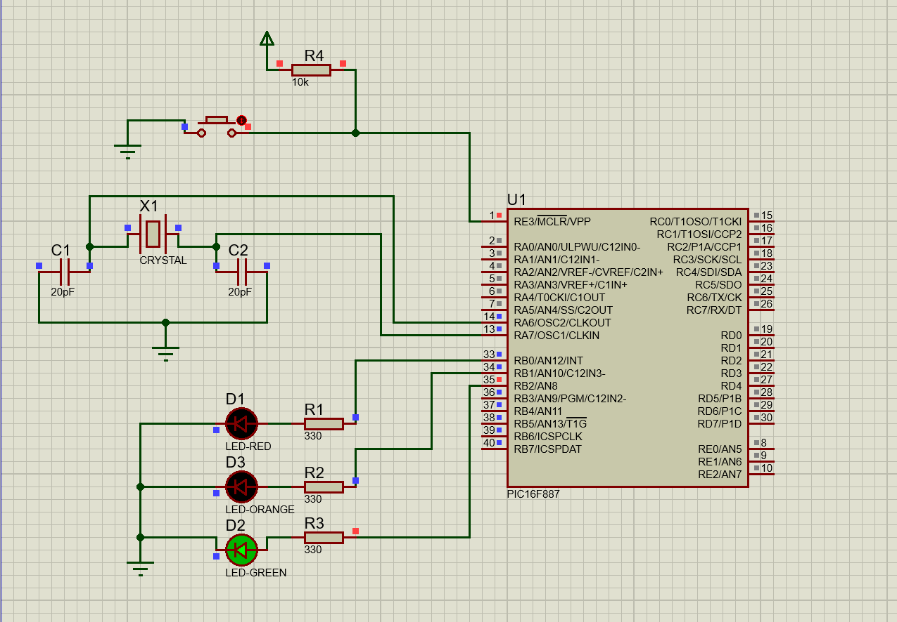
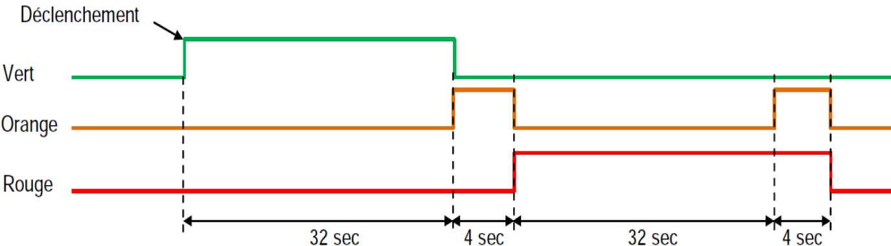

# Single-Traffic-Light-Management

## Description
This project simulates a single traffic light using a PIC16F887 microcontroller. The program automates the light sequence to organize traffic flow at a road intersection.

## Circuit
### Red Light
  
*Circuit setup when the red light is active.*

### Yellow Light
  
*Circuit setup when the yellow light is active.*

### Yellow & red Light
  
*Circuit setup when the yellow and red light is active.*

### Green Light
  
*Circuit setup when the green light is active.*

## Timeline
  

## Files
- `traffic_light.pdsprj`: Circuit schematic for 3 LEDs.
- `traffic_light.c`: MikroC program for managing a single traffic light.

## Instructions
1. Open `traffic_light.pdsprj` on Proteus.
2. Compile `traffic_light.c` in MikroC to generate the hex file.
3. Upload the hex file to Proteus and simulate the traffic light sequence.
4. Observe the red, yellow, and green lights transitioning in order.

## Tools
- MikroC Pro for PIC
- Proteus 8 professional
